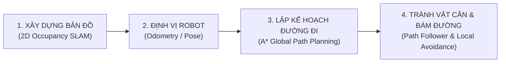

# 🚀 KẾ HOẠCH CHI TIẾT: ĐỒ ÁN XE TỰ HÀNH JETBOT (CAMERA + LIDAR)

> **TÊN ĐỀ TÀI:**  
> **"JetBot — Kết hợp Camera và LiDAR (Stereo Depth emulated LiDAR) để Xây dựng bản đồ, Định vị, Lập kế hoạch đường đi và Tránh vật cản"**  
> **Nền tảng:** NVIDIA Jetson Nano 4GB + Luxonis OAK-D S2 (DepthAI / VPU Myriad X) + Waveshare JetBot Chassis  
> **Kiến trúc mã nguồn:** Modular Architecture — **Mỗi tính năng 1 file riêng biệt** trong thư mục `modules/`.

---

## 🎯 1. BỐN TRỤ CỘT CỐT LÕI CỦA ĐỒ ÁN

1. **Xây dựng bản đồ (Mapping / SLAM):** Sử dụng các tia quét cắt lát từ Stereo Depth OAK-D S2 (tương đương 2D LiDAR) để tạo Bản đồ Chiếm dụng 2D (Occupancy Grid Map), đánh dấu vùng đi được và vật cản/tường. Hỗ trợ Lưu và Nạp bản đồ.
2. **Định vị (Localization):** Ước lượng vị trí $(X, Y, \theta)$ của JetBot thời gian thực bằng Odometry vi sai bánh xe và la bàn Yaw.
3. **Lập kế hoạch đường đi (Path Planning):** Khi người dùng click một điểm Goal trên bản đồ Web, thuật toán A* (A-Star) tự động tính toán đường đi ngắn nhất, tránh va quẹt tường nhờ kỹ thuật Costmap Inflation (phình to vật cản).
4. **Tránh vật cản & Tự hành (Obstacle Avoidance & Navigation):** Bộ điều khiển bám đường (Path Follower) điều khiển 2 bánh xe lái theo đường đi A*. Nếu xuất hiện chướng ngại vật đột xuất trên đường, xe tự né hoặc tính lại đường đi (Re-planning), có chốt chặn cuối Virtual Bumper phanh khẩn cấp khi cự ly $\le 25\text{cm}$.

---

## 📁 2. PHÂN BỔ MÔ-ĐUN: MỖI TÍNH NĂNG 1 FILE RIÊNG

Hệ thống được tổ chức theo chuẩn kỹ sư phần mềm Robotics, tách biệt hoàn toàn thành các file độc lập trong thư mục `modules/`:

| STT | Tên File Module | Trọng Trách & Tính Năng Chuyên Biệt | Trạng Thái |
| :---: | :--- | :--- | :---: |
| **01** | `modules/motor_controller.py` | **Tính năng 1: Điều khiển động cơ vi sai** Nhận vận tốc $(v, \omega)$, tính toán PWM chip PCA9685 (`0x60`) và cầu H TB6612FNG, giới hạn trần an toàn. | ✅ Hoàn thành |
| **02** | `modules/battery_monitor.py` | **Tính năng 2: Giám sát năng lượng & Pin** Giao tiếp I2C INA219 (`0x41`), đọc điện áp (V), dòng điện (A), công suất (W), tính toán phần trăm pin và cảnh báo an toàn. | ✅ Hoàn thành |
| **03** | `modules/camera_streamer.py` | **Tính năng 3: Thị giác Camera RGB & LaserScan từ Depth** Giao tiếp OAK-D S2, trích xuất ảnh màu RGB và cắt lát ma trận Stereo Depth tạo các tia LaserScan quang học (Virtual LiDAR). | ✅ Hoàn thành |
| **04** | `modules/localization.py` | **Tính năng 4: Định vị Robot (Robot Localization & Odometry)** Quản lý tọa độ $(X, Y, \theta)$ liên tục của xe trong hệ quy chiếu bản đồ (Map frame), tích hợp Dead-Reckoning từ tốc độ bánh xe. | ⏳ Cần tạo mới |
| **05** | `modules/occupancy_slam.py` | **Tính năng 5: Xây dựng bản đồ (2D Occupancy Grid SLAM)** Cập nhật lưới bản đồ ô vuông 2D (Free / Unknown / Occupied) từ tia quét LaserScan, hỗ trợ lưu bản đồ (`save_map`) và nạp bản đồ (`load_map`). | ⏳ Tách & Chuẩn hóa |
| **06** | `modules/path_planner.py` | **Tính năng 6: Lập kế hoạch đường đi (A\* Path Planning)** Thuật toán A-Star tìm đường đi tối ưu, tích hợp Costmap Inflation (phình to vật cản an toàn bán kính robot $15\text{cm}$) tránh cạ tường. | ⏳ Cần tạo mới |
| **07** | `modules/navigator.py` | **Tính năng 7: Điều hướng tự hành & Tránh vật cản** Bộ điều khiển bám đường (Path Follower) điều khiển xe bám theo các mốc tọa độ (Waypoints) của A\*, phát hiện vật cản bất ngờ để né hoặc tìm lại đường mới. | ⏳ Cần tạo mới |
| **08** | `modules/emergency_brake.py` | **Tính năng 8: Phanh khẩn cấp & Cản ảo (Virtual Bumper)** Chốt chặn an toàn phần cứng độc lập, ngắt lệnh tiến tức thì khi có vật cản trước mặt $\le 25\text{cm}$, luôn cho phép lùi thoát hiểm. | ✅ Hoàn thành |
| **09** | `modules/spatial_detector.py` | **Tính năng 9: Nhận diện đối tượng thị giác & Ngữ nghĩa** Chạy mô hình MobileNet-SSD trên chip VPU Myriad X, gắn nhãn 3D cho các đối tượng trong môi trường (Người, Ghế, Chai nước...). | ✅ Hoàn thành |
| **10** | `modules/web_server.py` | **Tính năng 10: Giao diện Web Cockpit & Điều phối nhiệm vụ** Cung cấp Web Cockpit Three.js, hiển thị bản đồ 2D trực quan, cho phép người dùng click chọn điểm đích Goal để xe tự hành tìm đường. | ✅ Hoàn thành |

---

## 📅 3. LỘ TRÌNH THỰC HIỆN CHI TIẾT (MILESTONES)

### 🟢 Giai đoạn 1: Nền tảng phần cứng, Cảm biến & An toàn (ĐÃ HOÀN TẤT)
- [x] **Bước 1.1:** Điều khiển động cơ vi sai qua I2C PCA9685/TB6612 (`modules/motor_controller.py`).
- [x] **Bước 1.2:** Giám sát điện áp pin INA219 thời gian thực (`modules/battery_monitor.py`).
- [x] **Bước 1.3:** Kết nối OAK-D S2 đọc ảnh RGB và ma trận Stereo Depth (`modules/camera_streamer.py`).
- [x] **Bước 1.4:** Phanh khẩn cấp Virtual Bumper lọc sạch sàn nhà (`modules/emergency_brake.py`).
- [x] **Bước 1.5:** Web Cockpit Three.js điều khiển phím WASD qua cổng 8080 (`modules/web_server.py`).

### 🟡 Giai đoạn 2: Định vị & Xây dựng bản đồ (ĐANG TIẾN HÀNH)
- [ ] **Bước 2.1:** Tạo module `modules/localization.py`:
  - Quản lý tọa độ $(X, Y, \theta)$ liên tục của JetBot.
  - Tích hợp công thức vi phân động học Odometry từ vòng quay bánh xe.
- [ ] **Bước 2.2:** Chuẩn hóa module `modules/occupancy_slam.py`:
  - Cắt lát ma trận Depth OAK-D S2 tạo tia quét 2D LaserScan (Virtual LiDAR).
  - Cập nhật bản đồ chiếm dụng lưới ô vuông 2D kích thước $8\text{m} \times 8\text{m}$, độ phân giải $5\text{cm/ô}$.
  - Viết API lưu bản đồ thành file JSON/PNG và nạp lại khi khởi động.

### 🟠 Giai đoạn 3: Lập kế hoạch đường đi A* & Điều hướng tự hành (TRỌNG TÂM ĐỒ ÁN)
- [ ] **Bước 3.1:** Xây dựng module `modules/path_planner.py`:
  - Cài đặt thuật toán Costmap Inflation: Mở rộng các ô vật cản thêm $15\text{cm}$ (bán kính thân xe JetBot) để tạo khoảng cách đệm an toàn.
  - Cài đặt thuật toán tìm đường ngắn nhất **A\* (A-Star)** từ điểm xuất phát đến điểm đích Goal.
  - Tối ưu hóa ma trận heuristic Euclidean/Manhattan đảm bảo thời gian tính toán $< 5\text{ms}$.
- [ ] **Bước 3.2:** Xây dựng module `modules/navigator.py`:
  - Bộ điều khiển bám đường (Path Follower / Pure Pursuit): Tính toán góc lái $\omega$ và vận tốc $v$ để bám sát từng Waypoint.
  - Bộ phát hiện cản động (Dynamic Obstacle Detection): Nếu đường đi phía trước bị chặn bởi vật thể mới, tự động kích hoạt tính năng tìm lại đường đi (Re-planning).
- [ ] **Bước 3.3:** Tích hợp giao diện Web Cockpit:
  - Cho phép người dùng click chuột trực tiếp vào một ô trên bản đồ 2D để đặt điểm đích Goal.
  - Hiển thị đường đi dự kiến A* bằng vệt sáng neon trên bản đồ 2D.
  - Nút bấm `START AUTONOMOUS NAV` (Bắt đầu tự hành) và `CANCEL NAV` (Hủy điều hướng).

### 🔵 Giai đoạn 4: Kiểm thử toàn diện & Đóng gói bảo vệ đồ án
- [ ] **Bước 4.1:** Kiểm thử xe tự tránh vật cản và tự hành từ điểm A đến điểm B trong phòng thực tế.
- [ ] **Bước 4.2:** Tự động hóa bộ test `scripts/self_test.py` cho toàn bộ các module.
- [ ] **Bước 4.3:** Đóng gói tài liệu báo cáo và video demo vận hành.
