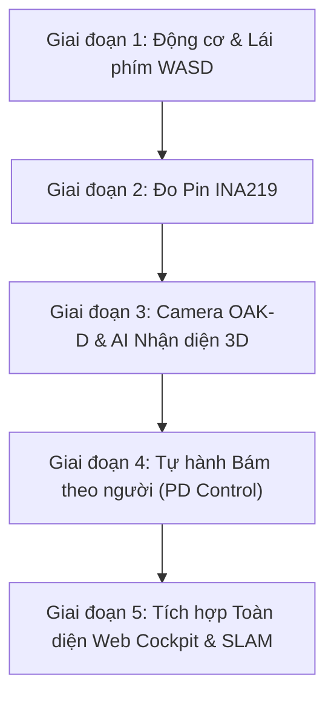

# 📋 KẾ HOẠCH TỪNG BƯỚC: KIỂM THỬ & TÍCH HỢP HỆ THỐNG JETBOT
## Môn học: CS532 — Thị giác máy tính trong tương tác người–máy
### Dự án: JetBot Semantic SLAM & Human-Robot Interaction (OAK-D S2 + Jetson Nano)

> **Phương châm:** *"Làm đến đâu, kiểm thử chắc đến đó"*. Mỗi tính năng được tách thành một module độc lập, kiểm tra chạy được 100% trước khi tích hợp vào `main.py`.

---

## 🎛️ QUY ƯỚC BẬT / TẮT TÍNH NĂNG TRONG `main.py`

Tại đầu file [main.py](file:///d:/Robot/main.py), bạn và nhóm có thể bật/tắt bất kỳ chức năng nào chỉ bằng cách đổi giá trị `ON` hoặc `OFF`:

```python
# ══════════════════════════════════════════════════════════════════════════════
# 🎛️ BẬT / TẮT CÁC TÍNH NĂNG Ở ĐÂY (DỄ DÀNG ĐỂ TEST TỪNG BƯỚC)
# ══════════════════════════════════════════════════════════════════════════════
ON  = True
OFF = False

MOTOR    = ON   # 1. Động cơ di chuyển (Bánh xe, phím lái WASD, phanh an toàn)
PIN      = ON   # 2. Đo pin thời gian thực INA219 (Điện áp V, %, Dòng A, Công suất W)
CAMERA   = ON   # 3. Camera OAK-D S2 (Luồng ảnh màu RGB & bản đồ độ sâu 3D)
YOLO     = ON   # 4. AI nhận diện người & vật thể (Tiny-YOLOv4 trên chip VPU)
FOLLOWER = OFF  # 5. Tự động bám theo người (Nên để OFF khi test lái tay bằng phím)
MAPPER   = OFF  # 6. Dựng bản đồ ngữ nghĩa 3D (Bật khi test SLAM)
WEB      = ON   # 7. Trạm điều khiển Web 3D Cockpit (Mở trình duyệt xem camera & lái xe)
```

---

## 🚀 LỘ TRÌNH 5 GIAI ĐOẠN KIỂM THỬ (PHÙ HỢP GIÁO TRÌNH CS532)



---

### GIAI ĐOẠN 1: ĐỘNG CƠ DI CHUYỂN & LÁI BẰNG PHÍM (KEYBOARD DRIVE)
* **Mục tiêu:** Kiểm tra phần cứng chip PCA9685 (`0x60`), cầu H TB6612, giải động học vi sai hai bánh và phanh an toàn khẩn cấp (Virtual Bumper).
* **Bài giảng lý thuyết liên quan:** `CS532-08B` (Mô hình chuyển động robot: pose, vận tốc, động học vi sai).
* **Bước 1 — Test module độc lập (Self-test):**
  ```bash
  python3 -m modules.motor_controller
  ```
  *(Kỳ vọng: Bánh xe quay tiến nhẹ 0.8s, lùi 0.8s, dừng lại an toàn).*
* **Bước 2 — Cấu hình cờ trong `main.py`:**
  ```python
  MOTOR = ON
  PIN = OFF
  CAMERA = OFF
  YOLO = OFF
  FOLLOWER = OFF
  WEB = ON
  ```
* **Bước 3 — Kiểm tra thực tế qua Web Cockpit:**
  - Chạy `python3 main.py`.
  - Mở trình duyệt `http://<IP_JETBOT>:8080`.
  - Bấm phím **W, A, S, D** hoặc dùng Joystick ảo: Robot phải chuyển động êm ái, nhả phím sau 0.5s robot tự dừng.
* **Tiêu chuẩn nghiệm thu:**
  - [x] Không bị lỗi thiếu quyền I2C (`sudo chmod 666 /dev/i2c-1`).
  - [x] Đúng chiều quay 2 bánh (tiến, lùi, quay trái, quay phải).
  - [x] Cơ chế Watchdog dừng xe trong 0.5s sau khi nhả phím.

---

### GIAI ĐOẠN 2: ĐO PIN & GIÁM SÁT NGUỒN THỜI GIAN THỰC (INA219)
* **Mục tiêu:** Đọc điện áp (V), dòng điện tiêu thụ (A), công suất (W) và tính % dung lượng pin 3S Li-ion (9.0V - 12.6V).
* **Tài liệu tham chiếu:** [references/hardware_and_platform/battery_ina219_guide.md](.agents/skills/jetbot-semantic-slam/references/hardware_and_platform/battery_ina219_guide.md).
* **Bước 1 — Test module độc lập:**
  ```bash
  python3 -m modules.battery_monitor
  ```
  *(Kỳ vọng: In ra bảng điện áp ~11.1V - 12.5V, dòng điện, công suất và % pin).*
* **Bước 2 — Cấu hình cờ trong `main.py`:**
  ```python
  MOTOR = ON
  PIN = ON
  CAMERA = OFF
  WEB = ON
  ```
* **Bước 3 — Kiểm tra thực tế:**
  - Mở Web `http://<IP_JETBOT>:8080`.
  - Quan sát thanh HUD Pin ở góc trên màn hình: Hiển thị đúng % pin và đổi màu cảnh báo khi pin < 20%.
* **Tiêu chuẩn nghiệm thu:**
  - [x] Đọc ổn định bus I2C địa chỉ `0x41` không bị văng lỗi.
  - [x] Không dùng thư viện Adafruit rườm rà, dùng Direct SMBus thuần.

---

### GIAI ĐOẠN 3: CAMERA OAK-D S2 & AI NHẬN DIỆN KHÔNG GIAN 3D (SPATIAL AI)
* **Mục tiêu:** Thu nhận luồng hình ảnh màu (RGB 15 FPS), bản đồ độ sâu (Depth), chạy Tiny-YOLOv4 trên chip VPU Myriad X và trích xuất tọa độ $(X, Y, Z)$ tính bằng mét.
* **Bài giảng lý thuyết liên quan:**
  - `CS532-08` (Hình học Camera Pinhole & Phép chiếu độ sâu 3D).
  - `CS532-12` & `13` (Mô hình Deep Learning cho robot & Tối ưu AI biên).
* **Bước 1 — Test module độc lập:**
  ```bash
  # Test camera & đo độ sâu:
  python3 -m modules.camera_streamer
  # Test thuật toán nhận diện không gian:
  python3 -m modules.spatial_detector
  ```
* **Bước 2 — Cấu hình cờ trong `main.py`:**
  ```python
  MOTOR = OFF    # Tắt motor để tập trung test camera
  PIN = ON
  CAMERA = ON
  YOLO = ON
  FOLLOWER = OFF
  WEB = ON
  ```
* **Bước 3 — Kiểm tra thực tế:**
  - Chạy `python3 main.py`.
  - Mở Web Cockpit: Khung hình video camera hiển thị mượt mà.
  - Khi có người đứng trước camera: Khung viền màu xanh lá đóng khung người, kèm nhãn `PERSON (khoảng cách: Z = ... mét)`.
  - Kiểm tra mức tải CPU của Jetson Nano: CPU phải $\le 40\%$ (nhờ hạ tần số depth $\le 3\text{ Hz}$).
* **Tiêu chuẩn nghiệm thu:**
  - [x] Nhận diện đúng đối tượng `person` với độ trễ thấp.
  - [x] Khoảng cách $Z$ tính bằng mét chính xác (sai số $< 10\text{cm}$ ở cự ly 1m - 2m).
  - [x] Camera không làm treo máy hay quá tải Jetson Nano.

---

### GIAI ĐOẠN 4: TỰ HÀNH BÁM THEO NGƯỜI (PERSON FOLLOWING & HRI)
* **Mục tiêu:** Kết hợp dữ liệu tọa độ người $(X, Z)$ từ Camera với Bộ điều khiển vi sai PD để xe tự động chạy theo người ở khoảng cách mong muốn ($0.8\text{m}$).
* **Bài giảng lý thuyết liên quan:**
  - `CS532-11` (Visual Tracking & Target Following).
  - `CS532-15` (Điều khiển PID cho robot).
* **Bước 1 — Test module độc lập:**
  ```bash
  python3 -m modules.person_tracker
  ```
* **Bước 2 — Cấu hình cờ trong `main.py`:**
  ```python
  MOTOR = ON
  PIN = ON
  CAMERA = ON
  YOLO = ON
  FOLLOWER = ON   # BẬT TỰ HÀNH BÁM NGƯỜI
  WEB = ON
  ```
* **Bước 3 — Kiểm tra thực tế:**
  - Đặt JetBot trên sàn nhà phẳng, một bạn đứng cách xe $1.5\text{m}$.
  - Xe tự động tiến lại gần và dừng lại cách bạn khoảng $0.8\text{m}$.
  - Bạn bước sang trái/phải: Xe tự xoay theo hướng bạn di chuyển.
  - Bạn lùi ra xa: Xe bám theo.
  - **Kiểm tra an toàn (Anti-Hijacking):** Nếu bấm phím WASD trên Web, xe lập tức nghe theo lệnh lái tay và tạm dừng bám người.
* **Tiêu chuẩn nghiệm thu:**
  - [x] Xe bám người mượt mà, không bị giật lắc liên tục.
  - [x] Khi người biến mất khỏi khung hình: Xe lập tức phanh dừng, không chạy lung tung.
  - [x] Phím lái tay luôn có quyền ưu tiên cao nhất.

---

### GIAI ĐOẠN 5: TÍCH HỢP TOÀN DIỆN VÀO WEB COCKPIT 3D & BẢN ĐỒ NGỮ NGHĨA SLAM
* **Mục tiêu:** Vận hành trạm điều khiển Web Cyber Cockpit 3D Three.js hoàn chỉnh: hiển thị mây điểm 3D, cọc mốc ngữ nghĩa (Semantic Markers), toàn bộ telemetry, cho phép bật tắt tính năng bằng nút bấm ngay trên Web.
* **Cấu hình cờ trong `main.py`:**
  ```python
  MOTOR = ON
  PIN = ON
  CAMERA = ON
  YOLO = ON
  FOLLOWER = OFF  # Bật/tắt tùy ý từ nút gạt trên giao diện Web
  MAPPER = ON     # BẬT DỰNG BẢN ĐỒ NGỮ NGHĨA
  WEB = ON
  ```
* **Kiểm tra thực tế:**
  - Truy cập `http://<IP_JETBOT>:8080`.
  - Trên Web có bảng điều khiển công tắc: Bấm toggle "Bám người", "Camera", "Động cơ" xem hệ thống bật/tắt tức thì mà không cần khởi động lại `main.py`.
  - Xem bản đồ 3D và cột mốc vị trí các vật thể cố định.

---

## 👥 PHÂN CÔNG NHIỆM VỤ THEO CẤU TRÚC MODULAR CHO 3 THÀNH VIÊN

| Thành Viên | Trách Nhiệm Module | Các File Phụ Trách | Cách Tự Test Độc Lập |
| :--- | :--- | :--- | :--- |
| **Thành viên 1** | Tầng Động cơ & Năng lượng | `modules/motor_controller.py`<br>`modules/battery_monitor.py` | `python3 -m modules.motor_controller`<br>`python3 -m modules.battery_monitor` |
| **Thành viên 2** | Tầng Thị giác máy & Edge AI | `modules/camera_streamer.py`<br>`modules/spatial_detector.py` | `python3 -m modules.camera_streamer`<br>`python3 -m modules.spatial_detector` |
| **Thành viên 3** | Tầng Điều khiển Tự hành & Web | `modules/person_tracker.py`<br>`modules/semantic_mapper.py`<br>`modules/web_server.py`<br>`main.py` | `python3 -m modules.person_tracker`<br>`python3 -m modules.web_server`<br>`python3 main.py` |

---

## ⚡ TỔNG HỢP LỆNH CHẠY NHANH TRÊN JETBOT

```bash
cd ~/catkin_ws/src/jetbot_slam

# 1. Cập nhật code mới nhất từ GitHub
git fetch origin main && git reset --hard origin/main
chmod +x main.py modules/*.py

# 2. Kiểm tra sức khỏe hệ thống (Verification)
python3 .agents/skills/jetbot-semantic-slam/scripts/check_system_health.py

# 3. Chạy hệ thống chính
python3 main.py
```
