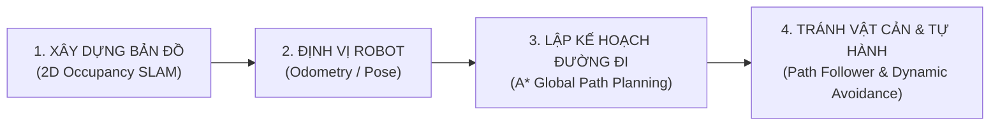

# 🤖 CS532 — ĐỒ ÁN XE TỰ HÀNH JETBOT: KẾT HỢP CAMERA VÀ LIDAR ĐỂ XÂY DỰNG BẢN ĐỒ, ĐỊNH VỊ, LẬP KẾ HOẠCH ĐƯỜNG ĐI VÀ TRÁNH VẬT CẢN

> **Môn học:** CS532 — Thị giác máy tính trong tương tác người–máy  
> **Tên đề tài:** *JetBot — Kết hợp Camera và LiDAR để xây dựng bản đồ, định vị, lập kế hoạch đường đi và tránh vật cản*  
> **Nền tảng phần cứng:** NVIDIA Jetson Nano 4GB (Ubuntu 18.04 / ROS Melodic / Python 3)  
> **Cảm biến thị giác & Chiều sâu:** Luxonis OAK-D S2 (DepthAI v2/v3, Intel Movidius Myriad X VPU)  
> **Giao diện điều khiển & Giám sát:** Web Cockpit Three.js Digital Twin (Port `8080`)

---

## 📖 1. TỔNG QUAN ĐỀ TÀI & GIẢI PHÁP KỸ THUẬT

Đề tài tập trung giải quyết bài toán cốt lõi của Robot Di động Tự hành (AMR - Autonomous Mobile Robot) trong môi trường trong nhà (Indoor Navigation) bao gồm **4 trụ cột chính**:



### 💡 Giải pháp kết hợp "Camera + LiDAR" trên phần cứng OAK-D S2:
Robot sử dụng camera không gian **Luxonis OAK-D S2** đóng vai trò kép:
1. **Camera RGB:** Thu nhận hình ảnh trực quan, nhận diện đối tượng bằng AI (Người, Ghế, Chai nước...) trên chip VPU Myriad X.
2. **LiDAR Quang Học (Stereo Depth emulated LiDAR):** Thay vì phải trang bị thêm cảm biến LiDAR cơ khí 360° đắt tiền và cồng kềnh, hệ thống sử dụng thuật toán **Depth Ray-Casting / Depth-to-LaserScan** để cắt lát ma trận đo chiều sâu Stereo Depth của OAK-D S2 thành **các tia quét LaserScan 2D**. Giải pháp này cung cấp cự ly đo đạt độ chính xác cao (từ $20\text{cm}$ đến $4.0\text{m}$), trực tiếp xây dựng bản đồ chiếm dụng 2D (Occupancy Grid Map) và phát hiện chướng ngại vật thời gian thực.

---

## ⚡ 2. BỐN TRỤ CỘT CỐT LÕI CỦA HỆ THỐNG

| Trụ cột | Công nghệ & Thuật toán | Chức năng chi tiết |
| :--- | :--- | :--- |
| **1. Xây dựng bản đồ (Mapping)** | 2D Occupancy Grid SLAM + Depth Ray-Casting | Quét môi trường lập lưới ô vuông $8\text{m} \times 8\text{m}$ (độ phân giải $5\text{cm/ô}$), hỗ trợ lưu và nạp bản đồ (`save_map` / `load_map`). |
| **2. Định vị (Localization)** | Dead-Reckoning Odometry + Yaw Angle Fusion | Ước lượng vị trí $(X, Y, \theta)$ liên tục của xe trong hệ quy chiếu toàn cục `map`. |
| **3. Lập kế hoạch đường đi (Path Planning)** | Thuật toán A\* (A-Star) + Costmap Inflation | Tìm đường đi ngắn nhất từ vị trí xe đến điểm đích Goal, tự động mở rộng vùng đệm an toàn quanh tường ($15\text{cm}$) chống cạ gầm. |
| **4. Tránh vật cản & Tự hành (Obstacle Avoidance)** | Path Follower + Dynamic Re-planning + Virtual Bumper | Xe tự động bám theo đường đi A\*. Khi có vật cản bất ngờ chặn đường, xe tự né hoặc tính lại đường mới; chốt chặn Virtual Bumper phanh khẩn cấp khi cự ly $\le 25\text{cm}$. |

---

## 📁 3. CẤU TRÚC MÔ-ĐUN: MỖI TÍNH NĂNG 1 FILE RIÊNG

Hệ thống được thiết kế theo chuẩn kỹ sư phần mềm Robotics, tách biệt hoàn toàn thành các file độc lập trong thư mục `modules/`:

```text
d:\Robot (catkin_ws/src/jetbot_slam)
├── config.py                     # Cấu hình trung tâm: Ngưỡng phanh, kích thước robot, tham số A*
├── main.py                       # Điểm khởi chạy chính: Điều phối toàn bộ các module & Web Cockpit
├── KE_HOACH_THUC_HIEN.md         # Kế hoạch chi tiết & Checklist lộ trình từng tính năng
├── CMakeLists.txt                # Cấu hình build package ROS Melodic
├── package.xml                   # Khai báo phụ thuộc package ROS
├── README.md                     # Tài liệu hướng dẫn dự án
│
├── modules/                      # KIẾN TRÚC MÔ-ĐUN HÓA (MỖI TÍNH NĂNG 1 FILE RIÊNG)
│   ├── __init__.py               # Khai báo package modules
│   ├── motor_controller.py       # Tính năng 1: Điều khiển động cơ vi sai PCA9685/TB6612
│   ├── battery_monitor.py        # Tính năng 2: Giám sát năng lượng & Pin INA219 (V, A, W, %)
│   ├── camera_streamer.py        # Tính năng 3: Thu nhận Camera RGB & LaserScan từ Depth OAK-D S2
│   ├── localization.py           # Tính năng 4: Định vị vị trí Robot (X, Y, Yaw) trên bản đồ
│   ├── occupancy_slam.py         # Tính năng 5: Xây dựng bản đồ chiếm dụng 2D (Lưu & Nạp bản đồ)
│   ├── path_planner.py           # Tính năng 6: Lập kế hoạch đường đi tối ưu A* & Costmap Inflation
│   ├── navigator.py              # Tính năng 7: Điều hướng tự hành bám quỹ đạo & Tránh vật cản động
│   ├── emergency_brake.py        # Tính năng 8: Phanh khẩn cấp phần cứng Virtual Bumper (<= 25cm)
│   ├── spatial_detector.py       # Tính năng 9: Nhận diện đối tượng thị giác AI VPU Myriad X
│   ├── web_server.py             # Tính năng 10: Giao diện Web Cockpit điều khiển & Đặt điểm Goal
│   └── templates/
│       └── cockpit.html          # Giao diện Web Cockpit Three.js Digital Twin tối tân
│
├── launch/                       # CÁC FILE KHỞI CHẠY ROS LAUNCH
│   ├── camera_ai.launch          # Launch driver OAK-D S2 ROS Publisher + TF base_to_camera
│   └── master.launch             # Launch toàn bộ hệ thống qua main.py + TF
│
└── scripts/                      # SCRIPT THỰC THI & KIỂM THỬ TỰ ĐỘNG
    ├── camera_streamer_node.py   # ROS Node Publisher chuyên trách OAK-D S2 & VPU Spatial AI
    └── self_test.py              # Suite kiểm thử tự động 53 bài test xác thực tính toàn vẹn hệ thống
```

---

## 🚀 4. HƯỚNG DẪN KHỞI CHẠY TRÊN JETBOT

### 4.1. Chuẩn bị môi trường trên Jetson Nano
```bash
cd ~/catkin_ws/src/jetbot_slam
git fetch origin && git reset --hard origin/main
chmod +x main.py scripts/*.py
```

### 4.2. Khởi chạy hệ thống

#### 🟢 Cách 1: Khuyên Dùng — 1 Terminal Duy Nhất (Tối ưu 60 FPS, Không Trễ)
Chạy trực tiếp điều phối trung tâm bằng Python 3:
```bash
python3 main.py
```
* **Ưu điểm:** Camera OAK-D S2 đưa dữ liệu trực tiếp vào RAM (Zero-Copy), VPU MobileNet-SSD tự chạy trên chip Myriad X, tải CPU cực thấp ($\le 15\%$), đạt tối đa **60 FPS**.
* **Tự động kích hoạt:** Động cơ, Đo pin, Camera OAK-D, AI VPU, Phanh khẩn cấp $< 25\text{cm}$ và Web Cockpit.

#### 🔵 Cách 2: Chế độ 2 Terminal qua ROS (Khi cần kết nối RTAB-Map / RViz)
Nếu bạn cần phát Topics hình ảnh cho các node ROS C++ ngoài:
* **Terminal 1:**
  ```bash
  roslaunch jetbot_slam camera_ai.launch confidence:=0.25
  ```
* **Terminal 2:**
  ```bash
  python3 main.py
  ```

---

## 🎮 5. ĐIỀU KHIỂN QUA GIAO DIỆN WEB COCKPIT

Mở trình duyệt trên điện thoại hoặc máy tính (cùng mạng Wi-Fi với JetBot):
```text
http://<IP_ROBOT>:8080    (Ví dụ: http://192.168.1.13:8080)
```

* **Bàn phím điều khiển (PC / Laptop):**
  - `W` / `Mũi tên Lên`: Tiến về phía trước (Tự động khóa phanh an toàn khi có cản $\le 25\text{cm}$).
  - `S` / `Mũi tên Xuống`: Lùi xe (Luôn cho phép lùi để thoát hiểm).
  - `A` / `Mũi tên Trái`: Quay trái tại chỗ.
  - `D` / `Mũi tên Phải`: Quay phải tại chỗ.
  - `Space`: Dừng xe khẩn cấp tức thì.
* **Tự hành Lập kế hoạch đường đi (Autonomous Navigation):**
  - Click chuột vào ô đích trên Bản đồ Occupancy Grid 2D ➔ Xe tự tính toán đường đi A* và bám theo lộ trình.
